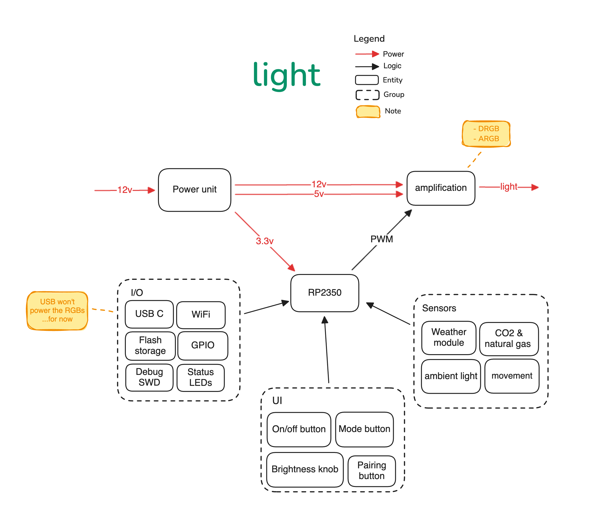

# Light

A WiFi-enabled LED light controller, based on the [RP2350](https://www.raspberrypi.com/products/rp2350/).

You can view the [PCB and schematics online here](https://kicanvas.org/?github=https://github.com/diegoasanch/light/blob/main/kicad/light.kicad_pro).

  

> [!WARNING]
> This project is still under development.

## What you'll see here

| File type                                     | Status      |
| --------------------------------------------- | ----------- |
| KiCad design files for the schematics and PCB | In-progress |
| Firmware source code                          | -           |
| Frontend source code                          | -           |
| 3D models for the enclosure                   | -           |

## Why

I'm currently leveling up my electronics skills and learning about PCB design; I did a [similar (albeit much more simple) project](https://github.com/diegoasanch/RGB-Controller) in the past, so since I'm already familiar with the concepts I thought it would be a good starter project into the world of PCBs.
