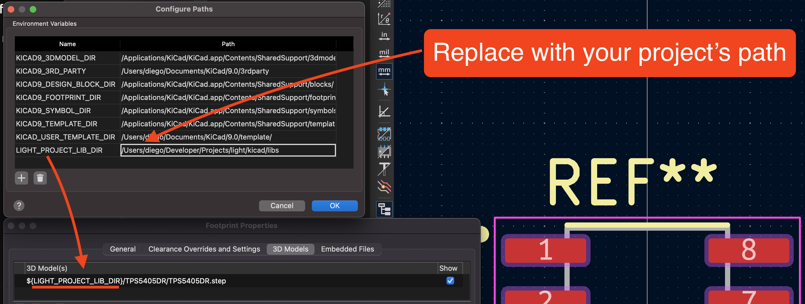

# Configuring KiCad

All of the symbols, footprints and 3D models are aliased using a variable `LIGHT_PROJECT_LIB_DIR` defined in KiCad.

To get the project working properly you must configure the variable in your machine to whatever the location of your project is.

To configure it go to `Preferences > Configure Paths...` and either create the new variable with name `LIGHT_PROJECT_LIB_DIR` using the project's location in your machine.

  

## PCB 3D Viewer

- Board color: #0A244A, 95% opacity
